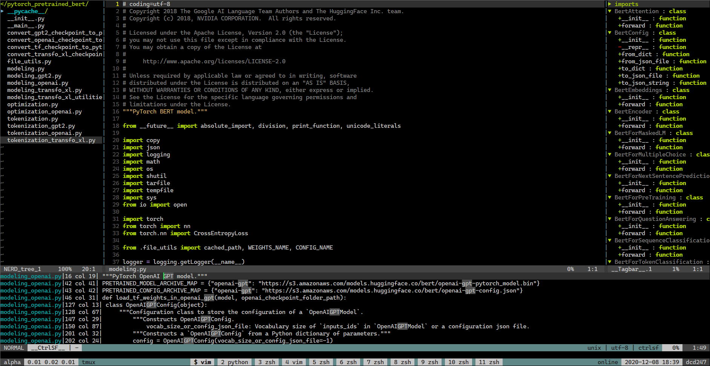

# Dotfiles

Personal dotfiles under *NIX systems.

## Theme

A material-design-style theme [papercolor](https://github.com/NLKNguyen/papercolor-theme) is adopted as the default theme for both vim and tmux.

## Preview



## Install

```bash
bash script/install.sh
```
